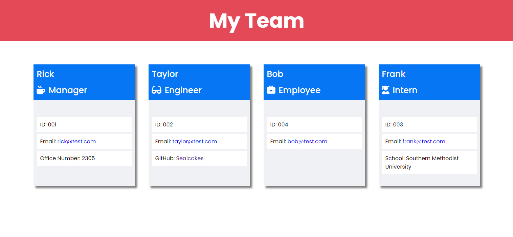

# Team Profile Generator

## Description 

This project takes in a managers information on them and their employees and generates an HTML page that has the employee information listed out conveniently.  Start the program, answer the prompt question in the command line and then once finished your webpage will automatically be generated.  During the coding process of this project I became more familiar with Inquirer and really got the hang of Jest, I also became more familiar with OOP, Classes and using object properties.

## Usage 

To use this project you will first need to install Inquirer and Jest via NPM using 'npm i' then you can run the application using 'npm start'.

## Screenshots

## Video Walkthrough

https://drive.google.com/file/d/1LF0Ys2Gy8CI31nLSx6wylDJRIVGJ94SX/view

## Links

Repository Link
https://github.com/Sealcakes/Team-Profile-Generator